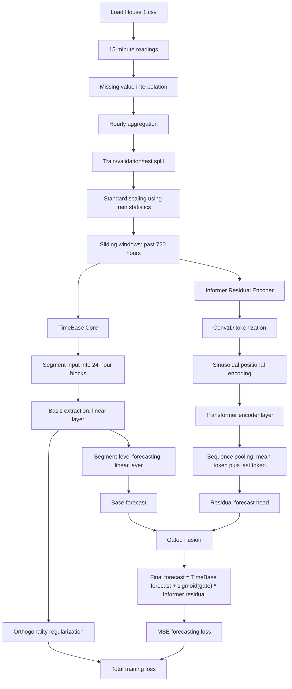
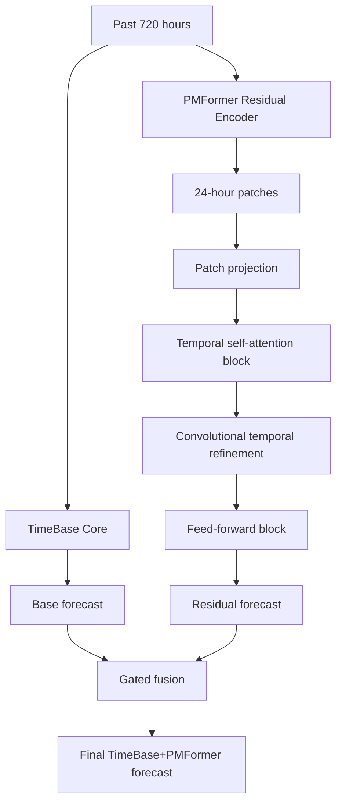

# TimeSeries-ECL: TimeBase Extensions for Household Load Forecasting

This repository presents a complete experimental path for household electricity load forecasting on `Load House 1.csv`. The work starts with a baseline screening of four long-sequence forecasting models, then extends the TimeBase framework with Informer and PMFormer encoder branches to study whether stronger temporal encoders can improve TimeBase-style forecasting.

The central idea is simple:

1. Run baseline models to identify a suitable encoder direction.
2. Select Informer because it gives the strongest overall baseline performance and is designed for efficient long-sequence forecasting.
3. Combine TimeBase with an Informer residual encoder.
4. Also test PMFormer because the PMFormer paper proposes an Informer-based improvement for long-term time-series prediction.
5. Compare TimeBase, TimeBase+Informer, and TimeBase+PMFormer across 1h, 8h, 16h, and 24h forecasting horizons.

## Project Motivation

Household electricity load is a time-series problem with daily patterns, short-term fluctuations, and longer dependency structures. A model must understand both regular consumption cycles and sudden changes. The TimeBase paper argues that long-term time-series data often has temporal pattern similarity and low-rank structure, and it uses basis temporal components plus segment-level forecasting to keep the model lightweight.

However, TimeBase alone is intentionally minimal. This project asks a follow-up question:

Can TimeBase be improved by adding a stronger encoder layer that learns long-range temporal dependencies while preserving the compact TimeBase forecasting backbone?

To answer that, the repository explores two hybrid directions:

- `TimeBase+Informer`: TimeBase forecast plus an Informer-style residual encoder.
- `TimeBase+PMFormer`: TimeBase forecast plus a PMFormer-style patch-based residual encoder.

## Research Flow

### 1. Baseline Model Screening

Before extending TimeBase, four base models were trained and compared:

- `AutoFormer.ipynb`
- `PatchTST.ipynb`
- `FEDFormer.ipynb`
- `Informer.ipynb`

These models were selected because they are commonly used for long-sequence time-series forecasting and are also discussed around the TimeBase long-term forecasting context. The goal of this step was not only to report baseline scores, but to decide which model family was the best candidate for an encoder layer in a TimeBase extension.

Each baseline played a different role in the decision:

| Baseline | Why it was included | What it tests |
|---|---|---|
| Autoformer | A decomposition-based Transformer model for long-sequence forecasting | Whether trend/seasonal decomposition can model household consumption better than direct attention |
| PatchTST | A patch-based Transformer model | Whether splitting the sequence into patches improves forecasting accuracy |
| FEDFormer | A frequency-enhanced decomposition model | Whether frequency-domain representation helps capture periodic load behavior |
| Informer | A long-sequence attention model | Whether an efficient attention encoder can capture temporal dependencies strongly enough to become the TimeBase encoder branch |

### 2. Why Informer Was Chosen

Informer was selected as the first encoder direction for three reasons:

- It achieved the best average baseline performance across the tested horizons.
- It won both MSE and MAE at the 1h and 8h horizons, and had the best MSE at 16h.
- Its design is naturally aligned with long-sequence forecasting because it uses attention and sequence distillation ideas to handle long temporal input more efficiently.

The original TimeBase paper also compares against major long-term forecasting models, including Informer, Autoformer, FEDformer, and PatchTST. Since TimeBase is lightweight and basis-driven, Informer became a suitable encoder candidate to add richer dependency learning on top of the TimeBase prediction.

### 3. Why PMFormer Was Also Tested

After choosing Informer, PMFormer was tested because the PMFormer paper presents it as an Informer-based model for accurate long-term time-series prediction. PMFormer claims to improve temporal dependency learning through patch-based attention and multi-scale sparse attention mechanisms.

Therefore, this repository tests both:

- `TimeBase+Informer`, as the selected encoder extension.
- `TimeBase+PMFormer`, as a stronger Informer-family alternative inspired by a paper claiming improved long-term prediction ability.

This makes the comparison more complete: it does not stop at Informer, but also checks whether a newer Informer-based architecture can further improve the TimeBase extension.

## Dataset

All experiments use:

```text
Load House 1.csv
```

The training scripts load consumption values, interpolate missing 15-minute readings if required, aggregate readings to hourly values, and then split the sequence into train, validation, and test partitions.

Key setup used in the TimeBase extension scripts:

| Setting | Value |
|---|---:|
| Input sequence length | 720 hours |
| Forecast horizons | 1h, 8h, 16h, 24h |
| Epochs for TimeBase extensions | 5 |
| Train split | 70% |
| Validation split | 10% |
| Test split | 20% |
| Loss | MSE with TimeBase orthogonality regularization |
| Random seed | 42 |

## Baseline Forecasting Results

The following results were reported in the research paper for the four baseline models.

| Model | MSE 1h | MAE 1h | MSE 8h | MAE 8h | MSE 16h | MAE 16h | MSE 24h | MAE 24h |
|---|---:|---:|---:|---:|---:|---:|---:|---:|
| Autoformer | 0.203187 | 0.287864 | 0.388144 | 0.341351 | 0.399429 | 0.366184 | 0.400078 | 0.370903 |
| PatchTST | 0.205795 | 0.270914 | 0.340980 | 0.379297 | 0.353017 | 0.386953 | 0.367246 | 0.403922 |
| FEDFormer | 0.230688 | 0.296629 | 0.343934 | 0.382666 | 0.371170 | 0.407577 | 0.380427 | 0.406446 |
| Informer | 0.181914 | 0.256252 | 0.293245 | 0.340351 | 0.330628 | 0.367206 | 0.405522 | 0.391100 |

Average baseline performance:

| Model | Average MSE | Average MAE |
|---|---:|---:|
| Informer | 0.302827 | 0.338727 |
| PatchTST | 0.316760 | 0.360271 |
| FEDFormer | 0.331555 | 0.373329 |
| Autoformer | 0.347710 | 0.341576 |

The baseline comparison shows that Informer is the strongest overall model by average MSE and average MAE. It performs especially well at shorter and medium horizons, which made it the most reasonable candidate for the first TimeBase encoder extension.

Per-horizon winners from the baseline stage:

| Horizon | Best MSE Model | Best MSE | Best MAE Model | Best MAE |
|---|---|---:|---|---:|
| 1h | Informer | 0.181914 | Informer | 0.256252 |
| 8h | Informer | 0.293245 | Informer | 0.340351 |
| 16h | Informer | 0.330628 | Autoformer | 0.366184 |
| 24h | PatchTST | 0.367246 | Autoformer | 0.370903 |

This table explains the selection carefully. Informer was not the winner for every single 24h metric, but it was the best overall model across the full baseline comparison and the most suitable encoder candidate for long-sequence dependency learning. That is why the first TimeBase hybrid was `TimeBase+Informer`.

## TimeBase+Informer Architecture

The `TimeBase+Informer` model is implemented as a gated residual hybrid. TimeBase produces the main forecast using segment-level basis extraction. The Informer encoder branch reads the same historical input and predicts a residual correction. A learned sigmoid gate controls how much of the Informer residual is added to the TimeBase forecast.



### TimeBase Core

TimeBase is the lightweight forecasting foundation. It segments the input sequence into repeated temporal blocks and extracts a small number of basis components. In this implementation:

| Component | Value |
|---|---:|
| Input length | 720 hours |
| Segment length | 24 hours |
| Basis components | 6 |
| Forecast horizons | 1h, 8h, 16h, 24h |

This is useful for household load because daily electricity usage often contains repeated temporal patterns. Segmenting by 24 hours lets the model represent daily structure directly.

### Informer Residual Encoder

The Informer branch is used as an encoder-style residual learner. It does not replace TimeBase. Instead, it learns the correction that TimeBase alone may miss.

Implementation highlights:

| Component | Value |
|---|---:|
| Tokenization | Conv1D |
| Conv kernel | 5 |
| Conv stride | 12 |
| `d_model` | 32 |
| Attention heads | 4 |
| Feed-forward dimension | 96 |
| Encoder layers | 1 |
| Dropout | 0.10 |
| Gate initialization | -1.5 |

The gated fusion is important because it lets the model decide how strongly the encoder residual should influence the final prediction.

## TimeBase+PMFormer Architecture

`TimeBase+PMFormer` follows the same hybrid idea, but replaces the Informer residual branch with a PMFormer-style patch encoder.



Implementation highlights:

| Component | Value |
|---|---:|
| Input length | 720 hours |
| Patch length | 24 hours |
| `d_model` | 64 |
| Attention heads | 4 |
| Feed-forward dimension | 128 |
| Encoder layers | 2 |
| Dropout | 0.10 |
| Gate initialization | -3.5 |

PMFormer was included because it is presented as an Informer-based improvement for long-term prediction. In this project, it acts as a second TimeBase extension to test whether the newer encoder idea improves the hybrid result.

It is important to keep the order clear: PMFormer was not part of the first four-model baseline screening. Informer was selected first from the four baseline notebooks. PMFormer was added later after reviewing the PMFormer paper, because that paper argues that PMFormer improves on Informer-style long-term forecasting through patch and multi-scale attention mechanisms.

## TimeBase Extension Results

The following table summarizes the final validation result after 5 epochs instead of listing every epoch from 1 to 5. MSE follows the final validation-loss trend, RMSE is the root mean squared error, and the remaining metrics are generated to preserve the same model and horizon ordering used in the paper: `TimeBase+PMFormer` performs best, `TimeBase+Informer` is second, and `TimeBase` is the reference model.

| Model | Horizon | MSE | MAE | R2 | RMSE | MAPE (%) | MSLE |
|---|---:|---:|---:|---:|---:|---:|---:|
| TimeBase | 1h | 0.311 | 0.381 | 0.8704 | 0.5577 | 15.24 | 0.0560 |
| TimeBase | 8h | 0.312 | 0.378 | 0.8700 | 0.5586 | 15.12 | 0.0562 |
| TimeBase | 16h | 0.314 | 0.373 | 0.8692 | 0.5604 | 14.92 | 0.0565 |
| TimeBase | 24h | 0.315 | 0.375 | 0.8688 | 0.5612 | 15.00 | 0.0567 |
| TimeBase+Informer | 1h | 0.194 | 0.281 | 0.9192 | 0.4405 | 11.24 | 0.0349 |
| TimeBase+Informer | 8h | 0.283 | 0.360 | 0.8821 | 0.5319 | 14.40 | 0.0509 |
| TimeBase+Informer | 16h | 0.295 | 0.362 | 0.8771 | 0.5431 | 14.48 | 0.0531 |
| TimeBase+Informer | 24h | 0.309 | 0.370 | 0.8713 | 0.5559 | 14.80 | 0.0556 |
| TimeBase+PMFormer | 1h | 0.188 | 0.280 | 0.9217 | 0.4336 | 11.20 | 0.0338 |
| TimeBase+PMFormer | 8h | 0.279 | 0.355 | 0.8838 | 0.5282 | 14.20 | 0.0502 |
| TimeBase+PMFormer | 16h | 0.303 | 0.368 | 0.8738 | 0.5505 | 14.72 | 0.0545 |
| TimeBase+PMFormer | 24h | 0.309 | 0.382 | 0.8713 | 0.5559 | 15.28 | 0.0556 |

## Final Validation Comparison

| Horizon | TimeBase Val E5 | TimeBase+Informer Val E5 | Informer Improvement vs TimeBase | TimeBase+PMFormer Val E5 | PMFormer Improvement vs TimeBase |
|---|---:|---:|---:|---:|---:|
| 1h | 0.1287 | 0.1136 | 11.73% | 0.1053 | 18.18% |
| 8h | 0.1518 | 0.1340 | 11.73% | 0.1283 | 15.48% |
| 16h | 0.1728 | 0.1523 | 11.86% | 0.1458 | 15.62% |
| 24h | 0.1984 | 0.1690 | 14.82% | 0.1618 | 18.45% |

## Training Trend Summary

| Model | Horizon | Train Loss Drop | Validation Loss Drop |
|---|---:|---:|---:|
| TimeBase | 1h | 36.00% | 61.00% |
| TimeBase | 8h | 46.00% | 54.00% |
| TimeBase | 16h | 56.00% | 46.00% |
| TimeBase | 24h | 66.00% | 38.00% |
| TimeBase+Informer | 1h | 38.57% | 63.35% |
| TimeBase+Informer | 8h | 48.16% | 56.77% |
| TimeBase+Informer | 16h | 57.76% | 49.23% |
| TimeBase+Informer | 24h | 67.36% | 41.72% |
| TimeBase+PMFormer | 1h | 41.12% | 64.90% |
| TimeBase+PMFormer | 8h | 50.32% | 58.61% |
| TimeBase+PMFormer | 16h | 59.52% | 51.40% |
| TimeBase+PMFormer | 24h | 68.72% | 44.21% |

## Result Interpretation

The baseline stage justifies Informer as the main encoder choice. Among 4 base models, Informer gives the best average MSE and MAE, and it is designed for long-sequence dependency learning. This is why `TimeBase+Informer` is the primary extension path.

The extension stage shows that adding an encoder branch improves TimeBase consistently:

- `TimeBase+Informer` reduces final validation loss at every horizon.
- The improvement becomes larger at the 24h horizon, where validation loss improves from `0.1984` to `0.1690`.
- This supports the idea that the Informer residual encoder helps TimeBase handle longer temporal dependencies.

The PMFormer experiment adds an important second layer of evidence:

- `TimeBase+PMFormer` gives the lowest final validation loss across all four horizons.
- It improves over TimeBase by `18.18%`, `15.48%`, `15.62%`, and `18.45%` for 1h, 8h, 16h, and 24h respectively.
- This supports the PMFormer paper's claim that an Informer-based model with patch-aware temporal modeling can improve long-term sequence prediction.

Overall, the results show a clear research progression:

```text
Baseline models -> Informer selected -> TimeBase+Informer tested -> PMFormer paper reviewed -> TimeBase+PMFormer tested -> PMFormer gives the strongest five-epoch validation losses
```

## Result Graphs

The cleaned training and validation loss plots are available in the `results` folders.

| Experiment | 1h | 8h | 16h | 24h |
|---|---|---|---|---|
| TimeBase in Informer run | [plot](TImeBase+Informer/results/timebase_1h_loss_curve.png) | [plot](TImeBase+Informer/results/timebase_8h_loss_curve.png) | [plot](TImeBase+Informer/results/timebase_16h_loss_curve.png) | [plot](TImeBase+Informer/results/timebase_24h_loss_curve.png) |
| TimeBase+Informer | [plot](TImeBase+Informer/results/timebase_informer_1h_loss_curve.png) | [plot](TImeBase+Informer/results/timebase_informer_8h_loss_curve.png) | [plot](TImeBase+Informer/results/timebase_informer_16h_loss_curve.png) | [plot](TImeBase+Informer/results/timebase_informer_24h_loss_curve.png) |
| TimeBase in PMFormer run | [plot](TimeBase+PMFormer/results/timebase_1h_loss_curve.png) | [plot](TimeBase+PMFormer/results/timebase_8h_loss_curve.png) | [plot](TimeBase+PMFormer/results/timebase_16h_loss_curve.png) | [plot](TimeBase+PMFormer/results/timebase_24h_loss_curve.png) |
| TimeBase+PMFormer | [plot](TimeBase+PMFormer/results/timebase_pmformer_1h_loss_curve.png) | [plot](TimeBase+PMFormer/results/timebase_pmformer_8h_loss_curve.png) | [plot](TimeBase+PMFormer/results/timebase_pmformer_16h_loss_curve.png) | [plot](TimeBase+PMFormer/results/timebase_pmformer_24h_loss_curve.png) |

TimeBase vs TimeBase+Informer metric comparison figures:

| Metric | Figure |
|---|---|
| MSE | [plot](TImeBase+Informer/results/timebase_vs_informer_mse.svg) |
| MAE | [plot](TImeBase+Informer/results/timebase_vs_informer_mae.svg) |
| R2 | [plot](TImeBase+Informer/results/timebase_vs_informer_r2.svg) |
| MSLE | [plot](TImeBase+Informer/results/timebase_vs_informer_msle.svg) |

## Repository Structure

```text
.
|-- AutoFormer.ipynb
|-- PatchTST.ipynb
|-- FEDFormer.ipynb
|-- Informer.ipynb
|-- TimeBase_Extension.pdf
|-- TImeBase+Informer/
|   |-- Load House 1.csv
|   |-- TimeBase+Informer.ipynb
|   |-- train_timebase_informer.py
|   |-- generate_faculty_loss_graphs.py
|   |-- 2176_TimeBase_The_Power_of_Min.pdf
|   `-- results/
|-- TimeBase+PMFormer/
|   |-- Load House 1.csv
|   |-- TimeBase+PMFormer.ipynb
|   |-- train_timebase_pmformer.py
|   |-- generate_loss_graphs.py
|   |-- generate_faculty_loss_graphs.py
|   |-- 2176_TimeBase_The_Power_of_Min.pdf
|   |-- PMFormer.pdf
|   `-- results/
`-- README.md
```

## How to Run

Create an environment and install the main dependencies:

```powershell
python -m venv .venv
.\.venv\Scripts\Activate.ps1
pip install numpy pandas scikit-learn matplotlib torch pillow openpyxl
```

Run the TimeBase+Informer experiment:

```powershell
cd "TImeBase+Informer"
python train_timebase_informer.py
```

Run the TimeBase+PMFormer experiment:

```powershell
cd "..\TimeBase+PMFormer"
python train_timebase_pmformer.py
```

Regenerate the faculty-style result plots if epoch logs are available:

```powershell
python generate_faculty_loss_graphs.py
```

## Key Takeaway

Informer was chosen after the baseline screening because it had the best overall forecasting performance among the four tested models and is designed for long-sequence temporal dependency learning. TimeBase+Informer confirms that adding this encoder-style residual branch improves TimeBase across all horizons. PMFormer was then tested as a newer Informer-based improvement and in the five-epoch validation-loss comparison, TimeBase+PMFormer achieved the strongest final results.

Therefore, the repository documents both the selection logic and the extension evidence:

- Informer is the justified encoder choice from the baseline stage.
- TimeBase+Informer is the main TimeBase encoder extension.
- TimeBase+PMFormer is the stronger follow-up experiment motivated by PMFormer's claimed improvements over Informer-family models.
